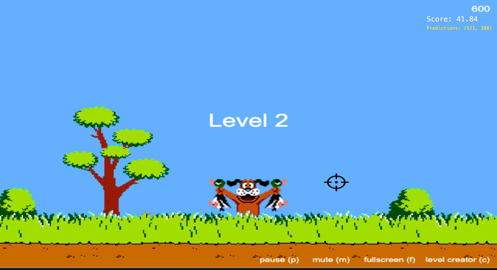

# Software Engineering with Applied AI

### Module 04 - AI and LLM Fundamentals for Programmers
#### Instructor: Erick Wendel,
Student: Robson Fagundes

Throughout the course, I explored the key fundamentals behind modern AI systems, particularly those utilizing the YOLO (You Only Look Once) concept. Now, the time has come to put theory into practice.

In this new module, we begin a project completely different from the previous ones: creating an artificial intelligence that plays the classic shooter game *Duck Hunt* on its own, entirely within the browser. The goal is to demonstrate how to use off-the-shelf object detection models to automate complex tasks, such as winning a game.