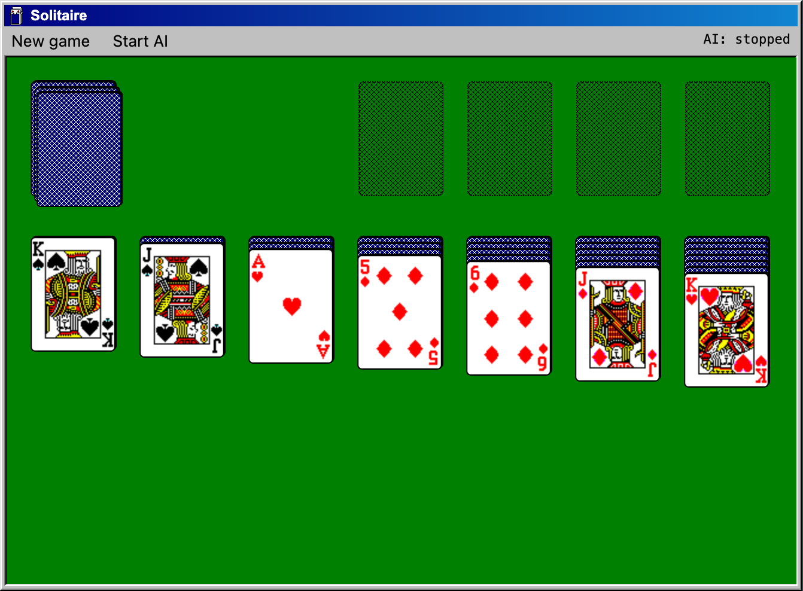
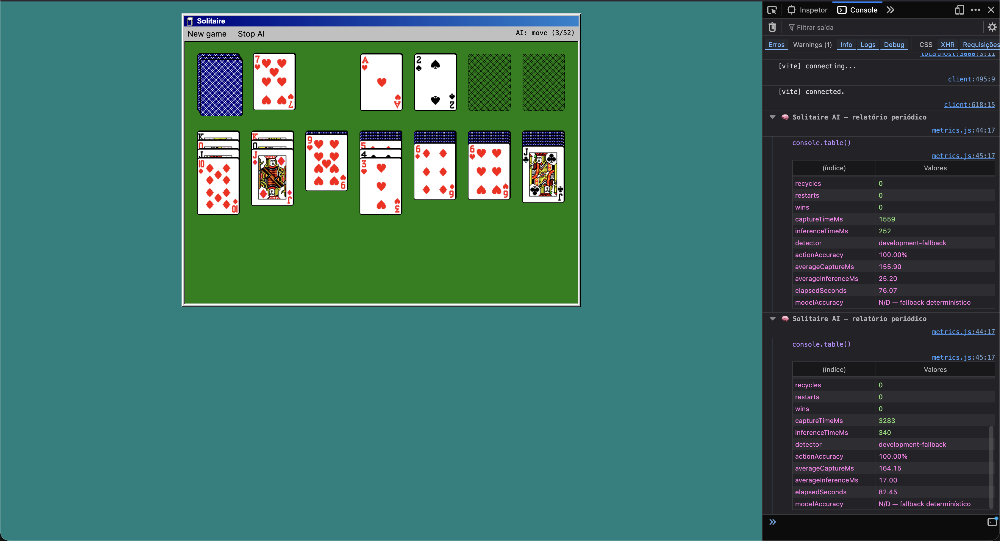
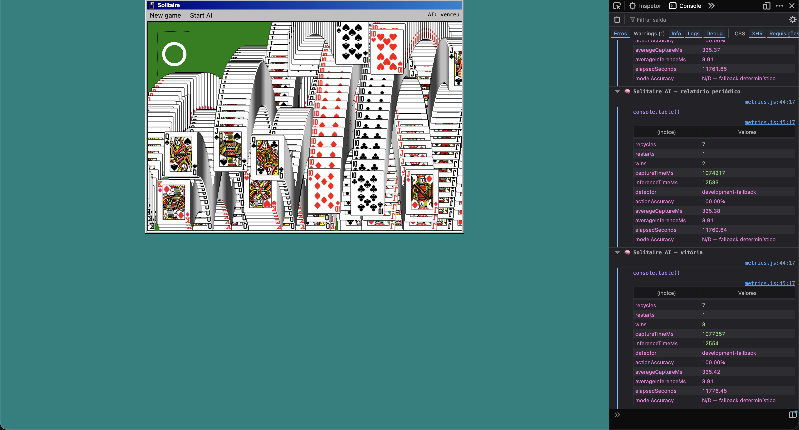

# JavaScript Solitaire Game

Jogo de paciência desenvolvido em JavaScript.

## Atualização do projeto

O projeto foi atualizado para funcionar com **Node.js 22**. Durante a modernização, foram realizadas as seguintes alterações:

- substituição do fluxo antigo de desenvolvimento e build baseado em Webpack pelo Vite;
- atualização das dependências de desenvolvimento, com uso do Vite 5 e do Sass;
- criação do arquivo `vite.config.mjs`, configurando o servidor local na porta `3000` e a saída de produção na pasta `build`;
- adequação do HTML para carregar o JavaScript como módulo ES;
- atualização dos scripts `start` e `build` no `package.json`;
- atualização do arquivo `yarn.lock` com as dependências compatíveis.

## Requisitos

- Node.js 22
- Yarn

## Executando em ambiente de desenvolvimento

```bash
yarn
yarn start
```

Depois, acesse `http://localhost:3000` no navegador.

## Gerando a versão de produção

```bash
yarn build
```

Os arquivos gerados serão salvos na pasta `build`.

## Jogador automático

O botão **Start AI** inicia o ciclo de automação:

1. o tabuleiro HTML é rasterizado e convertido com `createImageBitmap`;
2. o bitmap é transferido para um Web Worker;
3. as cartas visíveis são convertidas em predições e agrupadas por pilha;
4. o solver prioriza revelar cartas, abrir colunas e alimentar as fundações;
5. a ação escolhida é executada por eventos de mouse e uma nova captura confirma o estado.

Enquanto não houver um YOLO treinado para as 52 cartas, o worker utiliza as
observações determinísticas do próprio jogo como fallback de desenvolvimento. A
fronteira do worker e o formato das predições foram mantidos para permitir a troca
pelo modelo em `/public/model` sem alterar o solver ou o executor de ações.

### Estatísticas e acurácia

Durante a execução, um relatório é impresso no console do navegador a cada dez
ações, ao parar a IA e ao vencer. Para consultar a qualquer momento, execute no
console:

```js
solitaireAIStats()
```

`actionAccuracy` mede a porcentagem de ações que realmente alteraram o estado do
tabuleiro. `modelAccuracy` fica como `N/A` durante o fallback determinístico; a
acurácia do YOLO só deve ser calculada contra um conjunto de imagens rotuladas.

A descrição completa da arquitetura, estratégia e alterações está em
[IMPLEMENTACAO-AUTOMACAO-SOLITAIRE.md](IMPLEMENTACAO-AUTOMACAO-SOLITAIRE.md).

## Imagens

### Referência: automação do Duck Hunt


### Solitaire AI antes da execução



### Solitaire AI em execução



### Vitória e relatório final



Demo original: http://radovanjanjic.com/js-solitaire/
